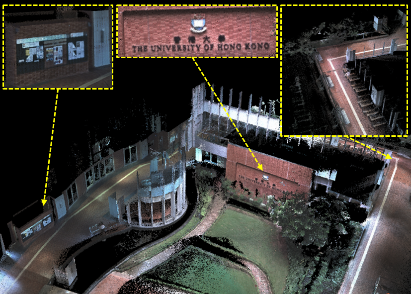
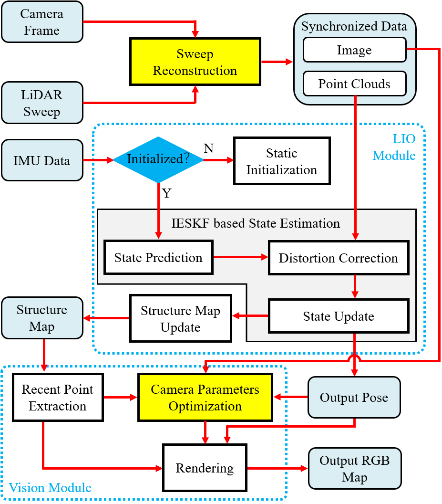
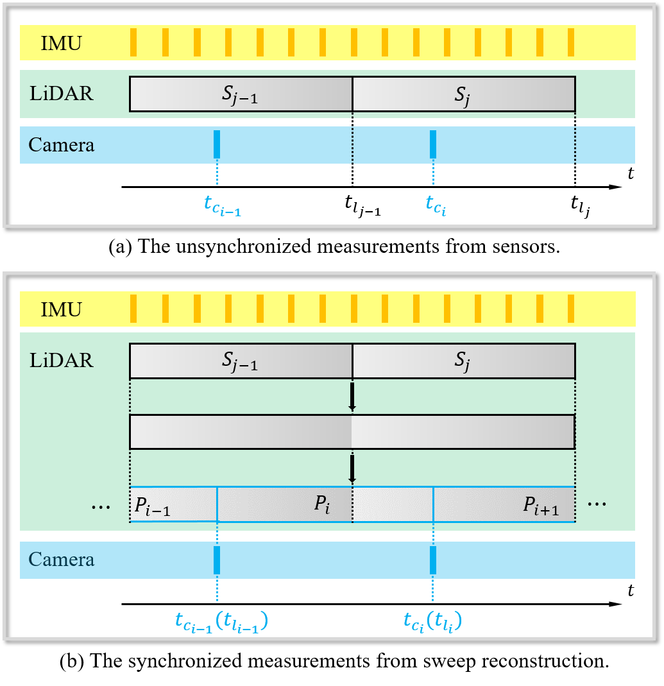

# SR_LIVO

**SR-LIVO** (LiDAR-Inertial-Visual Odometry and Mapping System with Sweep Reconstruction) is designed based on the framework of [**R3Live**](https://github.com/hku-mars/r3live). We employ the **sweep reconstruction** method to align reconstructed sweeps with image timestamps. This allows the LIO module to accurately determine states at all imaging moments, enhancing pose accuracy and processing efficiency. In **SR-LIVO**, an ESIKF is utilized to solve state in LIO module, and utilize an ESIKF to optimize camera parameters in vision module respectively for optimal state estimation and colored point cloud map reconstruction.

## Related Work

[SR-LIVO: LiDAR-Inertial-Visual Odometry and Mapping with Sweep Reconstruction](https://xplorestaging.ieee.org/document/10501952)

Authors: [*Zikang Yuan*](https://scholar.google.com/citations?hl=zh-CN&user=acxdM9gAAAAJ), *Jie Deng*, *Ruiye Ming*, [*Fengtian Lang*](https://scholar.google.com/citations?hl=zh-CN&user=zwgGSkEAAAAJ&view_op=list_works&gmla=ABEO0Yrl4-YPuowyntSYyCW760yxM5-IWkF8FGV4t9bs9qz1oWrqnlHmPdbt7LMcMDc04kl2puqRR4FaZvaCUONsX7MQhuAC6a--VS2pTsuwj-CyKgWp3iWDP2TS0I__Zui5da4) and [*Xin Yang*](https://scholar.google.com/citations?user=lsz8OOYAAAAJ&hl=zh-CN)

[SR-LIO: LiDAR-Inertial Odometry with Sweep Reconstruction](https://arxiv.org/abs/2210.10424)

Authors: [*Zikang Yuan*](https://scholar.google.com/citations?hl=zh-CN&user=acxdM9gAAAAJ), [*Fengtian Lang*](https://scholar.google.com/citations?hl=zh-CN&user=zwgGSkEAAAAJ&view_op=list_works&gmla=ABEO0Yrl4-YPuowyntSYyCW760yxM5-IWkF8FGV4t9bs9qz1oWrqnlHmPdbt7LMcMDc04kl2puqRR4FaZvaCUONsX7MQhuAC6a--VS2pTsuwj-CyKgWp3iWDP2TS0I__Zui5da4), *Tianle Xu* and [*Xin Yang*](https://scholar.google.com/citations?user=lsz8OOYAAAAJ&hl=zh-CN)

[SDV-LOAM: Semi-Direct Visual-LiDAR Odometry and Mapping](https://ieeexplore.ieee.org/abstract/document/10086694)

Authors: [*Zikang Yuan*](https://scholar.google.com/citations?hl=zh-CN&user=acxdM9gAAAAJ), *Qingjie Wang*, *Ken Cheng*, *Tianyu Hao* and [*Xin Yang*](https://scholar.google.com/citations?user=lsz8OOYAAAAJ&hl=zh-CN)

## Demo Video (2023-12-28 Update)

The **colored point cloud map (left)** and the **x8 Real-Time Performance** (right) on the sequence *hku_campus_seq_00* of self-collected dataset from [**R3Live**](https://github.com/hku-mars/r3live). On our currently hardware platform (**Intel Core i7-11700 and 32 GB RAM**) needs **30~34ms** to handle a sweep with image under this environment.

<div align="left">


</div>

## Pipeline

<div align="left">


</div>

**New Features:**
1. The **Sweep Reconstruction** module aligns the end timestamp of reconstructed sweep to the timestamp of captured image. Thus, the state of all image-captured moments can be solved by the more reliable LIO module instead of the hypersensitive VIO module.

2. In **SR-LIVO**, we utilize an ESIKF to solve state in LIO module, and utilize an ESIKF to optimize camera parameters in vision module respectively.

## Installation

### 1. Requirements

> GCC >= 7.5.0
>
> Cmake >= 3.16.0
> 
> [Eigen3](http://eigen.tuxfamily.org/index.php?title=Main_Page) >= 3.3.4
>
> [OpenCV](https://github.com/opencv/opencv) >= 3.3
>
> [PCL](https://pointclouds.org/downloads/) == 1.8 for Ubuntu 18.04, and == 1.10 for Ubuntu 20.04
>
> [Ceres](http://ceres-solver.org/installation.html) >= 1.14
>
> [ROS](http://wiki.ros.org/ROS/Installation)
>
> [Livox_ROS_Driver](https://github.com/Livox-SDK/livox_ros_driver)

##### Have Tested On:

| OS    | GCC  | Cmake | Eigen3 | OpenCV | PCL | Ceres |
|:-:|:-:|:-:|:-:|:-:|:-:|:-:|
| Ubuntu 20.04 | 9.4.0  | 3.16.3 | 3.3.7 | 4.2.0 | 1.10.0 | 1.14 |

### 2. Create ROS workspace

```bash
cd PATH_OF_LIVOX_ROS_DRIVER
source devel/setup.bash
cd ~
mkdir -p ~/SR-LIVO/src
cd SR-LIVO/src
```

### 3. Clone the directory and build

```bash
git clone https://github.com/ZikangYuan/sr_livo.git
cd ..
catkin_make
```
## Run on Public Datasets

Noted:

A. If you use the spinning LiDAR, please make sure the LiDAR point clouds have the "ring" channel information.

B. The warning message "Failed to find match for field 'time'." doesn't matter. It can be ignored.

C. **Please create a folder named "output" before running.** When **SR-LIVO** is running, the estimated pose is recorded in real time in the **pose.txt** located in the **output folder**.

D. we store the pose ground truth of the *NTU_VIRAL* dataset used by us as [TUM](https://vision.in.tum.de/data/datasets/rgbd-dataset) format. Please download from [Google drive](https://drive.google.com/drive/folders/1WnvzUzP_s70p4myPf5fsP1Jtr_62PnL1).

###  1. Run on [*R3Live_Dataset*](https://github.com/ziv-lin/r3live_dataset)

Before running, please type the following command to examine the image message type of ROS bag file:

```bash
rosbag info SEQUENCE_NAME.bag
```

If the image message type is **sensor_msgs/Image**, please type:

```bash
cd SR-LIVO
source devel/setup.bash
roslaunch sr_livo livo_r3live.launch
```

If the image message type is **sensor_msgs/CompressedImage**, please type:

```bash
cd SR-LIVO
source devel/setup.bash
roslaunch sr_livo livo_r3live_compressed.launch
```
Then open the terminal in the path of the bag file, and type:

```bash
rosbag play SEQUENCE_NAME.bag --clock -d 1.0
```

###  2. Run on [*NTU_VIRAL*](https://ntu-aris.github.io/ntu_viral_dataset/)

Please go to the workspace of **SR-LIVO** and type:

```bash
cd SR-LIVO
source devel/setup.bash
roslaunch sr_livo livo_ntu.launch
```

Then open the terminal in the path of the bag file, and type:

```bash
rosbag play SEQUENCE_NAME.bag --clock -d 1.0
```

## Citation

If you use our work in your research project, please consider citing:

```
@article{yuan2024sr,
  author={Yuan, Zikang, Deng, Jie, Ming, Ruiye, Lang, Fengtian and Yang, Xin},
  journal={IEEE Robotics and Automation Letters}, 
  title={SR-LIVO: LiDAR-Inertial-Visual Odometry and Mapping With Sweep Reconstruction}, 
  year={2024},
  volume={9},
  number={6},
  pages={5110-5117}
}
```

## Acknowledgments

Thanks for [R3Live](https://github.com/hku-mars/r3live), [CT-ICP](https://github.com/jedeschaud/ct_icp), [Fast-LIO](https://github.com/hku-mars/FAST_LIO) and [Open-VINs](https://github.com/vell001/open_vins).
